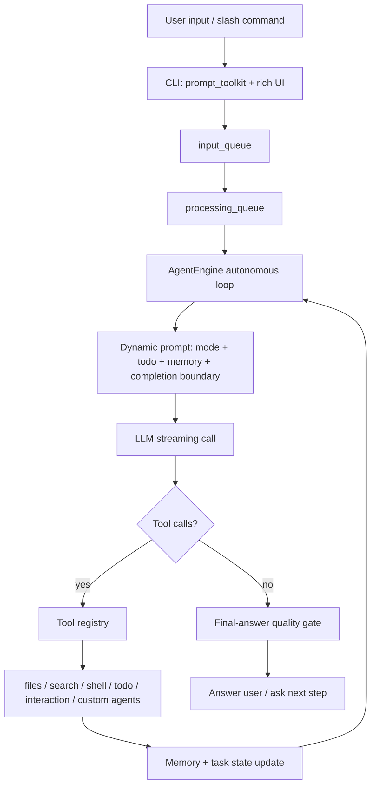

<p align="center">
  
</p>

<h1 align="center">Easy-Coding-Agent</h1>

<p align="center">
  <strong>An autonomous terminal coding agent with tools, modes, custom agents, task control, and evidence-gated long-task memory.</strong>
</p>

Easy-Coding-Agent is a Python coding-agent runtime designed around a real
autonomous development loop: understand the codebase, plan the current phase,
execute tools, edit files, run commands, ask the user when needed, preserve task
state, and continue until the work is verified or explicitly blocked.

This repo is not just a memory demo. The memory system is one reliability layer
inside a broader coding-agent platform.

## What The Agent Can Do

| Capability | Implementation |
|---|---|
| Interactive terminal agent | `main.py` provides a `prompt_toolkit` CLI with streaming output, slash commands, bottom toolbar state, and `Shift+Tab` mode switching. |
| Plan / Code / Chat modes | `core.prompts.get_system_prompt()` changes behavior between planning, implementation, and Q&A modes. |
| Autonomous execution loop | `core.engine.AgentEngine` runs a task-driven loop that keeps calling the model and tools until the task settles. |
| Task planning and progress | `core.task.TaskManager` maintains pending, in-progress, completed, and skipped tasks; tool calls update the active todo list. |
| Codebase exploration | `glob`, `grep`, `smart_search`, and `read` let the agent inspect files before editing. |
| File editing and generation | `read`, `write`, and `edit` support line-aware reads, new file generation, and targeted string replacement. |
| Command execution | `bash` executes shell / PowerShell commands and feeds results back into the agent loop. |
| Human-in-the-loop decisions | `ask_user` and `ask_selection` let the agent pause for clarification, phase approval, or loop recovery. |
| Custom agents | `/agent create`, `/agent use`, `/agent list`, `/agent edit`, `/agent preview`, and `@AgentName` support local specialist agents. |
| Loop and budget guards | The engine detects repeated tool calls, repeated user questions, simple-task over-exploration, and empty model responses. |
| Long-task continuity | Evidence-gated memory preserves refs, tool logs, task state, claims, and source-backed memories across context loss. |

## Agent Runtime



The engine uses a double-buffered async queue:

```text
input_queue -> processing_queue -> AgentEngine._run_autonomous_loop()
```

That design separates external user events from internal execution tasks. It
also lets the CLI stay responsive while the agent streams model output, runs
tools, updates memory, and waits for interactive choices.

## Built-in Toolchain

| Tool | Purpose |
|---|---|
| `read` | Read file content with line numbers and offset / limit support. |
| `write` | Create or overwrite files. |
| `edit` | Replace a unique string in a file. |
| `smart_search` | Precise code search using ripgrep-style search, syntax templates, and tree-sitter support. |
| `glob` | Find files by pattern. |
| `grep` | Regex search for legacy/simple search cases. |
| `bash` | Execute shell commands and return command output to the agent. |
| `todo_add` | Add a task to the current todo list. |
| `todo_update` | Mark a task pending, in progress, completed, or skipped. |
| `todo_list` | Render current task state. |
| `ask_user` | Ask the user for free-form input. |
| `ask_selection` | Ask the user to choose from options. |
| `agent_create` / `agent_use` / `agent_update` | Create, activate, edit, and manage local custom agents. |

The tool registry is decorator-based, so new tools can be added by registering a
function in `tools/` and importing it from `core/engine.py`.

## Modes

Easy-Coding-Agent has three runtime modes:

| Mode | Behavior |
|---|---|
| `Plan` | Reads and analyzes code, builds a task plan, and avoids writing code until the user approves. |
| `Code` | Default autonomous implementation mode. Plans the current phase, executes tools, edits files, and verifies work. |
| `Chat` | Q&A and explanation mode. Avoids file changes and command execution unless explicitly requested. |

The terminal prompt and bottom toolbar show the current mode. `Shift+Tab`
cycles modes without restarting the agent.

## Custom Agents

The project includes local custom-agent management, stored in
`memory/agents.json`.

Examples:

```text
/agent create
/agent list
/agent use BackendExpert
/agent preview <id>
/agent edit <id>
/agent delete <id>
@BackendExpert inspect the API layer and propose a fix
```

Each custom agent can carry a name, color, role definition, capabilities,
behavior rules, dialogue style, constraints, scenarios, and notes. Activating
an agent injects that definition into the runtime context so the same engine can
behave like a specialized coding assistant.

## Execution Controls

The agent runtime includes several control mechanisms that matter for real
coding work:

- **Phase workflow**: plan one major phase, ask for confirmation, execute,
  checkpoint, then propose the next phase.
- **Todo discipline**: complex tasks must become explicit todos before
  execution; finished tasks are marked completed to avoid repeated work.
- **Simple-task boundary**: read / explain / summarize requests use smaller
  tool budgets and stop after direct evidence is collected.
- **Repeated-tool guard**: identical repeated tool calls trigger loop recovery.
- **Repeated-question guard**: repeated `ask_user` / `ask_selection` calls are
  blocked when the agent appears stuck.
- **Final-answer gate**: unsupported completion claims can be rejected and
  converted into a repair instruction.

## Evidence-Gated Memory

The memory system is the reliability layer for long tasks. It is built as a
reusable package, `agent_memory_core`, and used by the agent through the memory
manager.

It records:

- user, assistant, tool, state, file, and test events
- large tool outputs in `refs/*.md`
- task nodes and current task state
- claims and whether they are supported
- long-term memories with source links
- coding entities such as files, functions, classes, tests, errors, commands,
  goals, and preferences
- retrieval logs with signal breakdowns

The key rule is: **important memories must stay connected to evidence.**

```text
tool result -> refs/*.md raw evidence
tool summary -> SQLite events / refs metadata
task progress -> task_nodes + task_state
retrieval -> FTS + entities + refs + temporal signals
prompt -> task state + sourced memories + evidence summaries
```

Quality gates enforce boundaries such as:

- file-content claims require read/search/ref evidence
- error explanations require command or test log evidence
- DONE requires verification evidence or an explicit unverified reason
- long-term memory facts require source refs
- conflicting or stale memories remain traceable to original events

## Memory Benchmark Snapshot

The benchmark layer measures **memory-subsystem retrieval and evidence recovery
after context wipe**. It is not an official LongMemEval score, LoCoMo
leaderboard score, or SWE-bench resolved rate.

Runner flow:

1. Ingest benchmark sessions into memory.
2. Close the memory object.
3. Reopen the same SQLite database.
4. Build context with `recent_dialogue_limit=0`.
5. Score whether rebuilt context contains expected answer terms, evidence
   terms, and source refs.

LongMemEval-S `limit=100`:

| Baseline | Cases | Retrieval / Term Recall | Evidence Source Coverage | Input Tokens | Latency p50 | False Fact Rate |
|---|---:|---:|---:|---:|---:|---:|
| `no_memory` | 100 | 0.01 | 0.00 | 1,321 | 0.0000s | 0.00 |
| `summary_memory` | 100 | 0.15 | 0.00 | 11,400 | 0.0000s | 0.00 |
| `long_context_only` | 100 | 0.54 | 0.36 | 5,500,800 | 0.0007s | 0.00 |
| `keyword_fts_memory` | 100 | 0.39 | 0.87 | 182,969 | 0.5088s | 0.00 |
| `vector_rag_memory` | 100 | 0.38 | 0.67 | 184,067 | 0.7292s | 0.00 |
| `evidence_gated_memory` | 100 | 0.40 | 0.87 | 178,117 | 0.9138s | 0.00 |

LoCoMo10 `limit=100`:

| Baseline | Cases | Retrieval / Term Recall | Evidence Source Coverage | Input Tokens | Latency p50 | False Fact Rate |
|---|---:|---:|---:|---:|---:|---:|
| `no_memory` | 100 | 0.01 | 0.02 | 1,141 | 0.0000s | 0.00 |
| `summary_memory` | 100 | 0.02 | 0.02 | 11,400 | 0.0000s | 0.00 |
| `long_context_only` | 100 | 0.19 | 0.99 | 1,792,483 | 0.0000s | 0.00 |
| `keyword_fts_memory` | 100 | 0.06 | 0.74 | 110,028 | 0.0241s | 0.00 |
| `vector_rag_memory` | 100 | 0.06 | 0.58 | 187,057 | 0.0411s | 0.00 |
| `evidence_gated_memory` | 100 | 0.06 | 0.74 | 182,886 | 0.0943s | 0.00 |

BEAM-lite `100K tokens / 50 cases`:

| Baseline | Cases | Retrieval / Term Recall | Evidence Source Coverage | Input Tokens | Latency p50 | False Fact Rate |
|---|---:|---:|---:|---:|---:|---:|
| `no_memory` | 50 | 0.00 | 0.00 | 450 | 0.0000s | 1.00 |
| `summary_memory` | 50 | 0.00 | 0.00 | 650 | 0.0000s | 1.00 |
| `long_context_only` | 50 | 1.00 | 1.00 | 5,910,300 | 0.0000s | 0.00 |
| `keyword_fts_memory` | 50 | 1.00 | 1.00 | 70,940 | 0.0131s | 0.00 |
| `vector_rag_memory` | 50 | 0.16 | 0.16 | 71,200 | 0.0308s | 0.84 |
| `evidence_gated_memory` | 50 | 1.00 | 1.00 | 109,140 | 0.0242s | 0.00 |

Reading the results:

- LongMemEval-S is the strongest current memory signal: evidence-gated memory
  is far stronger than plain summary memory and roughly matches keyword FTS
  while preserving source refs.
- LoCoMo10 is a known weakness: relationship-heavy long dialogue still needs
  stronger entity linking and temporal reasoning.
- BEAM-lite is a synthetic stress test for prompt cost and retrieval latency,
  not a real-world answer-accuracy benchmark.

## Reproduce

Install dependencies:

```powershell
pip install -r requirements.txt
pip install -r requirements-dev.txt
```

Run the interactive agent:

```powershell
python main.py
```

Run tests:

```powershell
python -m pytest tests -q
```

Run fixture benchmarks:

```powershell
python benchmark\memory_eval\run.py --suite longmemeval --baseline all --dataset benchmark\memory_eval\fixtures\longmemeval_lite.jsonl --limit 20
python benchmark\memory_eval\run.py --suite locomo_lite --baseline all --dataset benchmark\memory_eval\fixtures\locomo_lite.jsonl --limit 20
python benchmark\memory_eval\run.py --suite beam_lite --baseline all --beam-tokens 100000 --beam-cases 50
```

Download public data used by the memory-eval adapters:

```powershell
python benchmark\memory_eval\download_datasets.py --dataset locomo10
python benchmark\memory_eval\download_datasets.py --dataset longmemeval_s
```

Run larger memory-subsystem comparisons:

```powershell
python benchmark\memory_eval\run.py --suite longmemeval --baseline all --dataset benchmark\memory_eval\datasets\longmemeval_s_cleaned.json --limit 100 --progress-every 10
python benchmark\memory_eval\run.py --suite locomo_lite --baseline all --dataset benchmark\memory_eval\datasets\locomo10.json --limit 100 --progress-every 10
python benchmark\memory_eval\run.py --suite beam_lite --baseline all --beam-tokens 100000 --beam-cases 50 --progress-every 10
```

Run the SWE-bench-format memory probe:

```powershell
python benchmark\coding_memory\run.py --suite swe_bench_memory --baseline evidence_gated_memory --dataset benchmark\coding_memory\fixtures\swe_bench_mini.jsonl --limit 5
python benchmark\coding_memory\run.py --suite swe_bench_memory --baseline summary_memory --dataset benchmark\coding_memory\fixtures\swe_bench_mini.jsonl --limit 5
```

The SWE-bench probe tests whether issue context, failing-test evidence, task
state, and false-DONE prevention survive memory reconstruction. It does not
replace the official SWE-bench Docker harness for patch correctness.

## Memory Package Usage

```python
from agent_memory_core import CodingMemory

memory = CodingMemory(project_root=".", workspace=".agent_memory")

await memory.record_user_message("Fix the memory module bug")
await memory.record_tool_result(
    name="bash",
    args={"cmd": "pytest"},
    result="FAILED...\nTraceback...\nAttributeError...",
)

messages = await memory.build_prompt_context("What should I inspect next?")
gate = await memory.check_quality_gate({"to": "DONE", "evidence_refs": []})
```

## Storage Layout

```text
.agent_memory/
  memory.db
  refs/
  sessions/
  task_maps/
  exports/
```

## Repository Layout

```text
main.py                     interactive terminal entrypoint
core/                       engine, prompts, task state, streaming, config
tools/                      filesystem, shell, search, todo, interaction, agent tools
agent_memory_core/          reusable evidence-gated memory package
memory/                     compatibility layer and local long-term memory files
benchmark/memory_eval/      context-wipe retrieval and evidence benchmark
benchmark/coding_memory/    coding-memory and SWE-bench-format probes
docs/                       benchmark protocol, evidence model, setup notes
tests/                      unit and integration tests
```

## Current Claims

Reasonable claims:

- The repo implements an interactive terminal coding agent, not only a memory
  package.
- The agent supports mode switching, autonomous task execution, tool calls,
  project search, file editing, shell commands, human-in-the-loop decisions,
  custom local agents, and loop guards.
- The memory layer can rebuild prompt context after context wipe and preserve
  source refs for retrieved facts.
- The benchmark harness compares summary memory, long-context-only, keyword FTS,
  vector RAG, and evidence-gated memory under the same runner.

Claims not supported yet:

- Official LongMemEval or LoCoMo leaderboard accuracy.
- SWE-bench patch resolved rate.
- General superiority over vector RAG or long-context-only across all tasks.
- Full production sandboxing or enterprise permission control.

## Next Work

- Add a formal demo script that showcases the full coding-agent loop from
  project search to edit to verification.
- Improve custom-agent import/export and reusable specialist templates.
- Add answer generation and judge evaluation for LongMemEval / LoCoMo style
  answer accuracy.
- Improve LoCoMo-style entity linking, relationship tracking, and temporal
  reasoning.
- Connect generated `model_patch` outputs to the official SWE-bench Docker
  harness after the memory benchmarks are stable.
