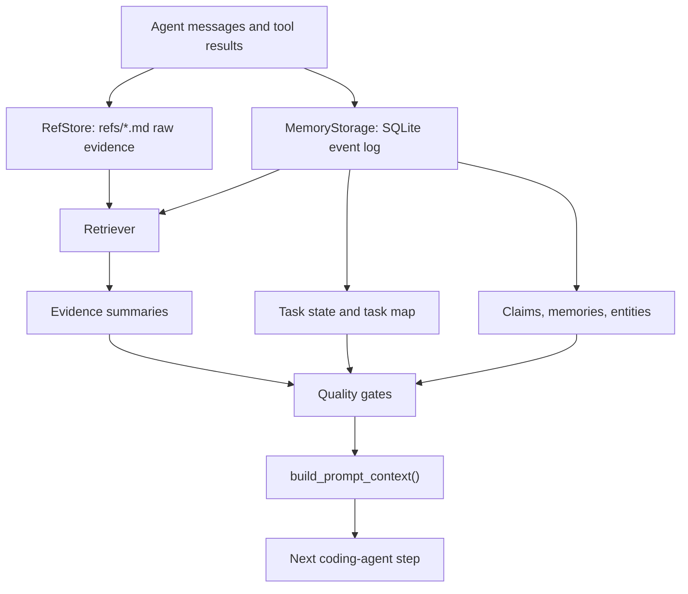

<p align="center">
  
</p>

# Easy-Coding-Agent

**Evidence-gated memory infrastructure for long-running coding agents.**

Easy-Coding-Agent is a Python coding-agent project centered on a reusable
memory subsystem, `agent_memory_core`. The goal is not to make another
short-context chatbot wrapper. The goal is to let coding agents survive long
tasks, recover after context loss, keep source evidence attached to every
important claim, and avoid saying "done" without verification.

At the system level, the project turns raw agent traces into a compact,
auditable prompt context:

```text
user / assistant / tool events
        |
        v
refs/*.md raw evidence  +  SQLite event/index tables
        |
        v
task state + task map + sourced memories + retrieval logs
        |
        v
quality-gated prompt context for the next agent step
```

## Why This Exists

Long-running coding agents fail in predictable ways:

- They lose the failing test log after the prompt window moves on.
- They remember summaries but cannot point back to the exact file, command, or
  tool output that supports the summary.
- They mark a task as complete without test evidence.
- They repeat old debugging paths because failure state was compressed away.
- They mix current facts, stale facts, and unsupported guesses in the same
  memory channel.

`agent_memory_core` is designed around the opposite rule: **store evidence
first, retrieve from evidence, and gate claims before they enter memory or
prompt context.**

## Technical Highlights

| Layer | What it does |
|---|---|
| Tool-result offloading | Large command outputs, searches, diffs, and logs are written to `refs/*.md`; prompt context carries summaries plus stable `result_ref` pointers. |
| SQLite memory store | Events, refs metadata, task nodes, task state, claims, sourced memories, extracted entities, memory items, source links, and retrieval logs are stored locally. |
| Coding entity extraction | The memory index extracts files, functions, classes, tests, errors, commands, goals, and user preferences from dialogue and tool traces. |
| Multi-signal retrieval | Retrieval combines exact ref hits, FTS/BM25, entity matches, file matches, task focus, failure priority, source confidence, recency, and temporal intent. |
| Evidence gates | File claims require read/search/ref evidence; error diagnoses require command/test evidence; DONE requires verification evidence or an explicit unverified reason. |
| Soft task state machine | Agent state is tracked across `UNDERSTANDING`, `GATHERING_CONTEXT`, `PLANNING`, `EDITING`, `TESTING`, `DEBUGGING`, `WAITING_USER`, and `DONE`. |
| Append-only memory maturation | New facts are inserted as new rows instead of overwriting old rows, so stale or conflicting facts can be traced back to their sources. |
| Benchmark harness | The repo includes memory-subsystem evaluations for LongMemEval-style data, LoCoMo-style dialogue, BEAM-lite synthetic stress, and SWE-bench-format coding memory probes. |

## Architecture



The important design choice is that the memory system does not treat a summary
as truth by default. Summaries are only useful when they stay connected to raw
evidence and can be audited later.

## What Is Measured

The benchmark layer currently measures **memory-subsystem retrieval and
evidence recovery after context wipe**. It is not claiming an official
LongMemEval score, LoCoMo leaderboard score, or SWE-bench resolved rate.

The runner flow is intentionally strict:

1. Ingest benchmark sessions into memory.
2. Close the memory object.
3. Reopen the same SQLite database.
4. Build context with `recent_dialogue_limit=0`.
5. Score whether the rebuilt memory context contains expected answer terms,
   evidence terms, and source refs.

This makes the numbers useful for comparing memory strategies under context
loss. It does not yet prove final answer quality because the runner does not
attach an answer generator or judge.

## Benchmark Snapshot

LongMemEval-S `limit=100`:

| Baseline | Cases | Retrieval / Term Recall | Evidence Source Coverage | Input Tokens | Latency p50 | False Fact Rate |
|---|---:|---:|---:|---:|---:|---:|
| `no_memory` | 100 | 0.01 | 0.00 | 1,321 | 0.0000s | 0.00 |
| `summary_memory` | 100 | 0.15 | 0.00 | 11,400 | 0.0000s | 0.00 |
| `long_context_only` | 100 | 0.54 | 0.36 | 5,500,800 | 0.0007s | 0.00 |
| `keyword_fts_memory` | 100 | 0.39 | 0.87 | 182,969 | 0.5088s | 0.00 |
| `vector_rag_memory` | 100 | 0.38 | 0.67 | 184,067 | 0.7292s | 0.00 |
| `evidence_gated_memory` | 100 | 0.40 | 0.87 | 178,117 | 0.9138s | 0.00 |

LoCoMo10 `limit=100`:

| Baseline | Cases | Retrieval / Term Recall | Evidence Source Coverage | Input Tokens | Latency p50 | False Fact Rate |
|---|---:|---:|---:|---:|---:|---:|
| `no_memory` | 100 | 0.01 | 0.02 | 1,141 | 0.0000s | 0.00 |
| `summary_memory` | 100 | 0.02 | 0.02 | 11,400 | 0.0000s | 0.00 |
| `long_context_only` | 100 | 0.19 | 0.99 | 1,792,483 | 0.0000s | 0.00 |
| `keyword_fts_memory` | 100 | 0.06 | 0.74 | 110,028 | 0.0241s | 0.00 |
| `vector_rag_memory` | 100 | 0.06 | 0.58 | 187,057 | 0.0411s | 0.00 |
| `evidence_gated_memory` | 100 | 0.06 | 0.74 | 182,886 | 0.0943s | 0.00 |

BEAM-lite `100K tokens / 50 cases`:

| Baseline | Cases | Retrieval / Term Recall | Evidence Source Coverage | Input Tokens | Latency p50 | False Fact Rate |
|---|---:|---:|---:|---:|---:|---:|
| `no_memory` | 50 | 0.00 | 0.00 | 450 | 0.0000s | 1.00 |
| `summary_memory` | 50 | 0.00 | 0.00 | 650 | 0.0000s | 1.00 |
| `long_context_only` | 50 | 1.00 | 1.00 | 5,910,300 | 0.0000s | 0.00 |
| `keyword_fts_memory` | 50 | 1.00 | 1.00 | 70,940 | 0.0131s | 0.00 |
| `vector_rag_memory` | 50 | 0.16 | 0.16 | 71,200 | 0.0308s | 0.84 |
| `evidence_gated_memory` | 50 | 1.00 | 1.00 | 109,140 | 0.0242s | 0.00 |

### Reading These Results

LongMemEval-S is the strongest current signal: `evidence_gated_memory` is far
stronger than plain summary memory and roughly matches keyword FTS while keeping
source-backed evidence constraints. It does not beat `long_context_only` on raw
term recall, but the long-context baseline uses about 5.5M input tokens in this
100-case run.

LoCoMo10 is a known weakness. The current system can often recover source
evidence, but answer-term recall remains low for relationship-heavy long
dialogue. That is a retrieval and reasoning gap to improve, not a win to
overstate.

BEAM-lite is a synthetic scale stress test. It shows that the memory layer can
recover target evidence from a 100K-token synthetic corpus with much lower
prompt cost than long-context-only. It should not be treated as a real-world
answer-accuracy benchmark.

## Reproduce

Install dependencies:

```powershell
pip install -r requirements.txt
pip install -r requirements-dev.txt
```

Run the test suite:

```powershell
python -m pytest tests -q
```

Run fixture benchmarks:

```powershell
python benchmark\memory_eval\run.py --suite longmemeval --baseline all --dataset benchmark\memory_eval\fixtures\longmemeval_lite.jsonl --limit 20
python benchmark\memory_eval\run.py --suite locomo_lite --baseline all --dataset benchmark\memory_eval\fixtures\locomo_lite.jsonl --limit 20
python benchmark\memory_eval\run.py --suite beam_lite --baseline all --beam-tokens 100000 --beam-cases 50
```

Download public data used by the memory-eval adapters:

```powershell
python benchmark\memory_eval\download_datasets.py --dataset locomo10
python benchmark\memory_eval\download_datasets.py --dataset longmemeval_s
```

Run larger memory-subsystem comparisons:

```powershell
python benchmark\memory_eval\run.py --suite longmemeval --baseline all --dataset benchmark\memory_eval\datasets\longmemeval_s_cleaned.json --limit 100 --progress-every 10
python benchmark\memory_eval\run.py --suite locomo_lite --baseline all --dataset benchmark\memory_eval\datasets\locomo10.json --limit 100 --progress-every 10
python benchmark\memory_eval\run.py --suite beam_lite --baseline all --beam-tokens 100000 --beam-cases 50 --progress-every 10
```

Run the SWE-bench-format memory probe:

```powershell
python benchmark\coding_memory\run.py --suite swe_bench_memory --baseline evidence_gated_memory --dataset benchmark\coding_memory\fixtures\swe_bench_mini.jsonl --limit 5
python benchmark\coding_memory\run.py --suite swe_bench_memory --baseline summary_memory --dataset benchmark\coding_memory\fixtures\swe_bench_mini.jsonl --limit 5
```

The SWE-bench probe tests whether issue context, failing-test evidence, task
state, and false-DONE prevention survive memory reconstruction. It does not
replace the official SWE-bench Docker harness for patch correctness.

## Memory Package Usage

```python
from agent_memory_core import CodingMemory

memory = CodingMemory(project_root=".", workspace=".agent_memory")

await memory.record_user_message("Fix the memory module bug")
await memory.record_tool_result(
    name="bash",
    args={"cmd": "pytest"},
    result="FAILED...\nTraceback...\nAttributeError...",
)

messages = await memory.build_prompt_context("What should I inspect next?")
gate = await memory.check_quality_gate({"to": "DONE", "evidence_refs": []})
```

Public interface:

```text
record_user_message(text)
record_assistant_message(text, tool_calls=None)
record_tool_result(name, args, result, tool_call_id=None)
build_prompt_context(current_user_request=None)
check_quality_gate(proposal)
commit_task_outcome(result)
add_memory(content, memory_type="Decision", source_refs=None)
save_session()
```

## Storage Layout

```text
.agent_memory/
  memory.db
  refs/
  sessions/
  task_maps/
  exports/
```

Core tables include:

- `events`: user, assistant, tool, state, file, and test evidence.
- `refs`: Markdown ref metadata for large logs, outputs, searches, and diffs.
- `task_nodes`: task-map nodes with status, files, summaries, and refs.
- `task_state`: current state, current goal, and goal version.
- `claims`: important assistant claims with support status.
- `memories` and `memory_items`: sourced long-term memory and append-only facts.
- `entities`: coding-oriented entity index.
- `memory_sources`: links from memories back to events or refs.
- `retrieval_logs`: selected context rows and signal breakdowns.

## Repository Layout

```text
agent_memory_core/          reusable evidence-gated memory module
benchmark/memory_eval/      context-wipe retrieval and evidence benchmark
benchmark/coding_memory/    coding-memory and SWE-bench-format probes
core/                       interactive coding-agent engine
memory/                     compatibility layer for older memory APIs
tools/                      filesystem, shell, search, todo, and interaction tools
docs/                       benchmark protocol, evidence model, setup notes
tests/                      unit and integration tests
```

## Current Claims

Reasonable claims:

- The project contains a reusable local memory package for coding agents.
- The memory system can rebuild prompt context after context wipe.
- Retrieved facts preserve links back to source refs and event rows.
- Quality gates can block unsupported DONE, file, and error claims from being
  treated as verified memory.
- The benchmark harness compares summary memory, long-context-only, keyword FTS,
  vector RAG, and evidence-gated memory under the same runner.

Claims not supported yet:

- Official LongMemEval or LoCoMo leaderboard accuracy.
- SWE-bench patch resolved rate.
- General superiority over vector RAG or long-context-only across all tasks.
- Strong long-dialogue relationship reasoning on LoCoMo-style questions.

## Next Work

- Add answer generation and judge evaluation for LongMemEval / LoCoMo style
  answer accuracy.
- Improve LoCoMo-style entity linking, relationship tracking, and temporal
  reasoning.
- Preserve per-case retrieval artifacts for easier third-party audit.
- Add adapters for external memory systems to make the benchmark comparison
  more independent.
- Connect generated `model_patch` outputs to the official SWE-bench Docker
  harness after the memory benchmarks are stable.
